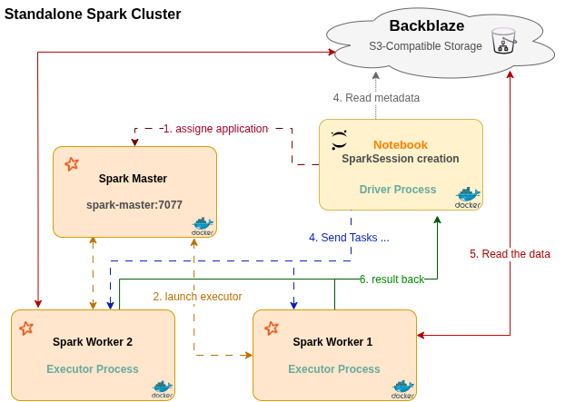

# Spark Cluster Docker — Standalone Spark + Cloud Ingestion + Jupyter
 
A standalone Apache Spark cluster (master + worker) running in Docker, reading data directly from cloud storage (Backblaze B2, S3-compatible) and processing it with PySpark through Jupyter.
 
I wanted a project focused only on Spark itself — setting up a real cluster, connecting it to cloud storage, and actually using distributed processing, not just importing `pyspark` locally and calling it a day.
 
## Architecture



## What's inside
 
- Standalone Spark cluster, Spark 3.5.0 (1 master + 1 worker, scalable)
- Jupyter (pyspark-notebook) to explore the data
- Data stored in Backblaze B2 (S3-compatible) instead of locally — no manual upload step, no local object storage to keep running
- Tested with real NYC Taxi trip data (~50MB parquet, 2M+ rows)
## Why two custom Docker images
 
I first used `bitnami/spark:3.5.0` for master/worker. Broadcom put Bitnami's images behind a paid subscription, so that image can't be pulled for free anymore. I built my own Spark image instead: [`ibrahimelaidouni/my-custom-spark`](https://hub.docker.com/r/ibrahimelaidouni/my-custom-spark).
 
For Jupyter, a different problem showed up. `jupyter/pyspark-notebook` doesn't come with the jars needed to read from S3-compatible storage. My Spark image already had them, that's why running a script with `spark-submit` worked without any extra config. But Jupyter's Spark installation lives in a different folder than the one in my custom Spark image, so I had to find the right path and put the jars there myself. I built a second image with the jars already in place: [`ibrahimelaidouni/my-custom-jupyter`](https://hub.docker.com/r/ibrahimelaidouni/my-custom-jupyter).
 
Both images are already built and pushed to Docker Hub. Cloning this repo and running `docker compose up -d` pulls them directly, no manual jar setup needed.
 
## Project structure
 
```
spark-cluster-docker/
├── docker-compose.yaml
├── jupyter-image/
│   └── Dockerfile              # builds ibrahimelaidouni/my-custom-jupyter
├── common/
│   ├── __init__.py
│   └── spark.py                # shared get_spark() function
├── notebooks/
│   └── NYC-Taxi-Analysis.ipynb
├── jobs/
│   └── test.py
├── .env.example
├── .gitignore
└── README.md
```
 
## Prerequisites
 
- Docker Desktop / Docker Engine
- A free Backblaze B2 account (or any S3-compatible bucket) with your data uploaded
That's it, no local Spark install needed.
 
## Setup
 
### 1. Clone the repo
```bash
git clone https://github.com/im-brahim/spark-cluster-docker.git
cd spark-cluster-docker
```
 
### 2. Get your data into cloud storage
I used a Backblaze B2 bucket and uploaded a NYC Taxi trip parquet file (source: [NYC TLC Trip Record Data](https://www.nyc.gov/site/tlc/about/tlc-trip-record-data.page)). Any S3-compatible bucket works, the point of this project is the infra, not the dataset itself.
 
### 3. Configure credentials
Copy `.env.example` to `.env` and fill in your bucket's endpoint, region, access key and secret key:
```
B2_ENDPOINT=https://s3.<region>.backblazeb2.com
B2_REGION=<region>
B2_ACCESS_KEY=<your key id>
B2_SECRET_KEY=<your application key>
```
`.env` is gitignored, never commit real credentials.
 
### 4. Start the cluster
```bash
docker compose up -d
```
This pulls the images and starts master, worker, and Jupyter.
 
UI access:
- `localhost:8080` — Spark Master UI
- `localhost:8081` — Worker UI
- `localhost:8889` — Jupyter
### Scaling workers
```bash
docker compose up -d --scale spark-worker=3
```
More workers means more resources used on your machine, make sure you have them free. If you scale past the port range set in `docker-compose.yaml` (default `8081-8083`), extend it yourself.
 
## Using it
 
Open `localhost:8889`, then in a notebook cell:
 
```python
from common.spark import get_spark
 
spark = get_spark("NYC Taxi Analysis")
df = spark.read.parquet("s3a://your-bucket/input/your-file.parquet")
df.show()
```
 
The same `get_spark()` function works the same way in the notebook or with `spark-submit` inside the master container, one shared config, nothing to change between the two.
 
Don't forget `spark.stop()` when you're done. A Spark session left alive in a notebook keeps holding onto worker resources, if you only have 1 core allocated and forget to stop a session, the next job you run just hangs waiting for a core that's never coming free. Learned this one the hard way.
  
## A couple of things worth knowing

- Early on, I recreated the `spark-master` container mid-debugging and the Master UI showed 0 workers connected — restarting the worker fixed it at the time. When I later tried to reproduce this cleanly (`docker compose up -d --force-recreate spark-master` alone, then just refreshing the UI, nothing else touched), the worker reconnected on its own without any manual restart. Best explanation: Docker Compose's embedded DNS re-resolves the `spark-master` service name fresh on each new connection, and Spark standalone workers already have built-in reconnect logic — they ping the master and re-register if disconnected. So a plain master recreate seems to self-heal. The original issue was likely caused by something else going on at the same time, since I was mid-debugging several things at once. If you ever do see a worker stuck at 0 in the UI, `docker compose restart spark-worker` is still the quick fix.

- The S3A jars need to be on the classpath of both the driver and the executors — the driver uses them to list files and plan partitions, the executors use them to actually read each partition directly from B2. In this setup, master and worker share the same custom Spark image, so both already had the jars. The part that needed a separate fix was the driver when running inside Jupyter's container instead of the master's — since Jupyter uses a different image with a different jar folder.

## What's next
 
- Compare speed and resource usage between a local pandas read and this distributed Spark setup, to actually show why distributed processing matters here
- Do real exploratory analysis and aggregations on the taxi data, using groupBy/partitioning to actually touch the distributed and parallel side of Spark, not just read the file
- Try automating worker scale up/down based on the job being submitted, instead of manually setting `--scale`